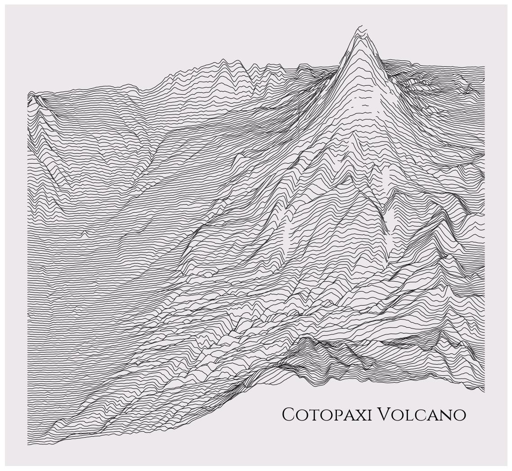
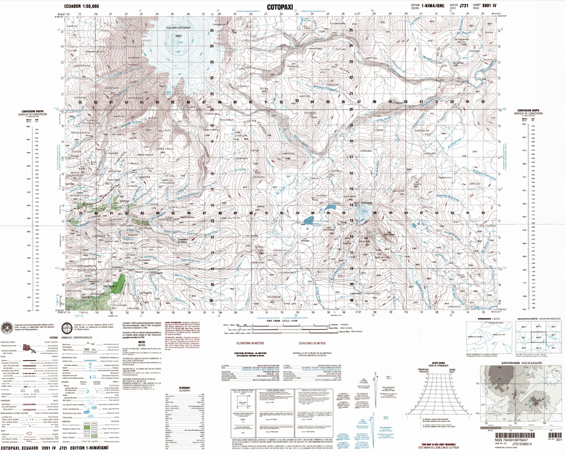
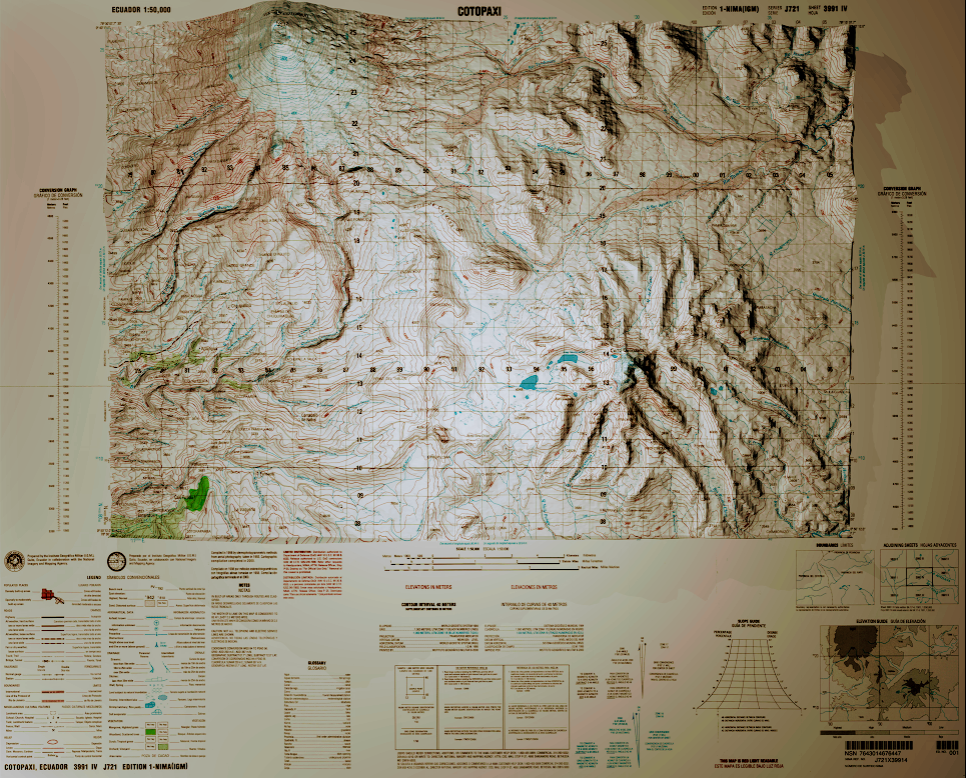
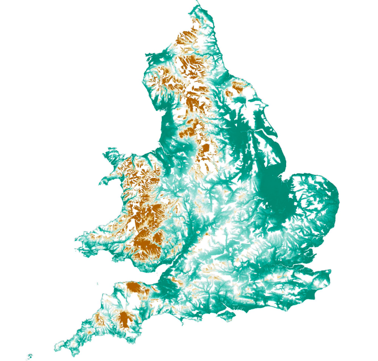
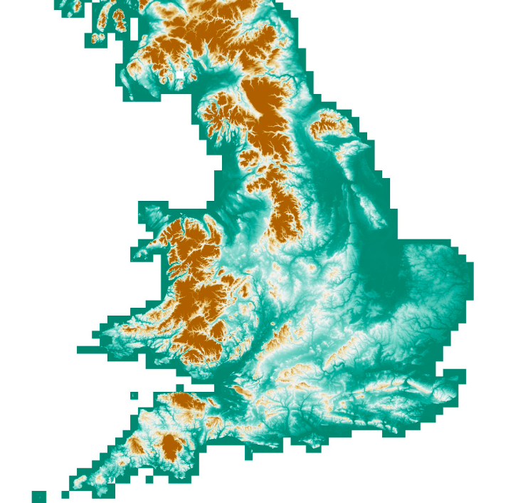

# Latest news

---

## A ridge map of Cotopaxi volcano

This is Ecuador's tallest active volcano Cotopaxi on a ridge map. Map via ridge_map from [@colindcarroll](https://twitter.com/colindcarroll) such an amazing tool!

---

## Plotting global surface water

I combined Google Earth Engine, OpenStreetMap and Mapbox to plot global surface water

- Yellow outline is water derived from OpenStreetmMap
- Grid is Water Occurrence derived from Landsat (Pekel et al., 2016)

---

## Realistic 3D Cotopaxi volcano

An old topographic map from my country brought to life.
The Cotopaxi volcano with a peak of 5897 m in Ecuador. 
View larger [https://photos.app.goo.gl/de9yeaB3YFzrTF9C9](https://photos.app.goo.gl/de9yeaB3YFzrTF9C9)
Thanks to [@jscarto](https://twitter.com/jscarto) for the tips.

Original Cotopaxi map         |  Blender3D Cotopaxi
:---------------------:|:---------------------:
 | 

--- 

## Void-filled LIDAR for England

Filling voids in LIDAR data using OS Terrain 50, handling/interpolating ~150 million cells!

Original LIDAR         |  Void-filled LIDAR
:---------------------:|:---------------------:
  |  

---
